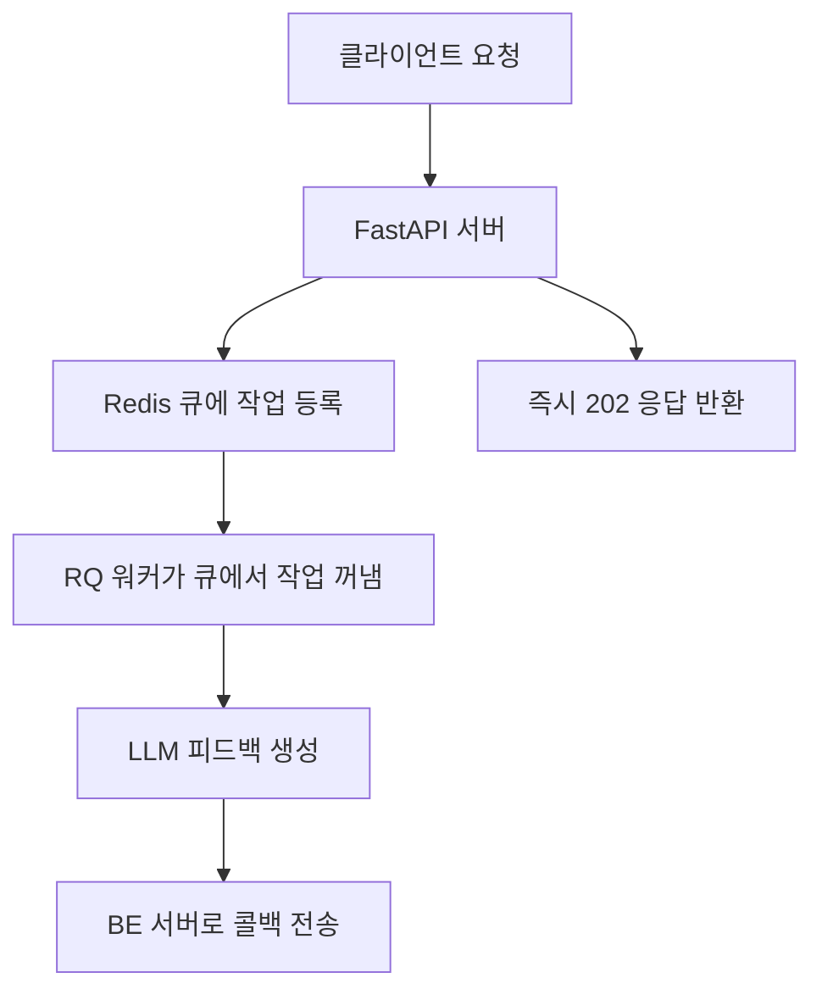

# 오늘 내가 배운 것들(Today I Learned)

- 챗봇 테스트 실행(Langfuse) 및 vLLM설치 진행
- 결국 공간 부족으로 못함(150GB 이상 필요,...)
- GCP 인스턴스 재 생성하여 300GB로 디스크 용량 맞출예정

## 피드백 모델 리펙토링 (큐 도입)

- 현재 코드에선 피드백 생성 .시 작업이 FastAPI 서버 프로세스 내에서만 비동기로 실행될 뿐, 외부 큐 시스템(분산 작업 및 멀티프로세스)은 사용하지 않은 상태
- 여러 동시다발적 요청을 대비하여 큐를 도입할 예정

---

- 파이썬 내장 큐 VS 외부 큐 장단점 비교

| **구분** | **파이썬 내장 큐**      | **Redis/Celery 등 외부 큐** |
| ------ | ----------------- | ----------------------- |
| 설치/운영  | ✅ 별도 설치 불필요       | ❌ Redis/Celery 설치/운영 필요 |
| 메모리    | ❌ 서버 재시작 시 작업 사라짐 | ✅ 영속성, 재시작 후에도 유지       |
| 확장성    | ❌ 단일 서버 내에서만 동작   | ✅ 여러 서버/워커로 분산 처리       |
| 모니터링   | ❌ 제한적             | ✅ 상세한 모니터링/관리 도구        |
| 재시도    | ❌ 수동 구현 필요        | ✅ 자동 재시도, 데드레터 큐        |

- 현재 리프레쉬 프로젝트에서의 피드백 기능은,  사용자의 단체 및 개인 챌린지의 이행 여부에 따라 피드백을 해주는 기능이다 

### 그럼 왜 FastAPI BackgroundTasks 안쓰고 Redis Queue를 쓰는가?

- 우선, FastAPI BackgroundTasks 한계

1. 메모리 기반
    - 작업이 서버 메모리에만 저장
    - 서버 재시작 시 모든 진행 중인 작업 손실
    - 서버가 죽으면 작업이 날아감

2. 단일 서버 제한
    - 하나의 FastAPI 프로세스에서만 처리
    - 여러 서버로 확장해도 작업 분산 불가
    - 서버 부하가 높으면 전체 시스템 영향

3. 모니터링 관리 어려움
    - 작업 상태 확인 어려움
    - 실패한 작업 재시도 어려움
    - 작업 큐 길이, 처리 속도 등 모니터링 불가



### RQ워커가 뭘까?

- Redis 큐에 쌓인 작업을 꺼내서 실행하는 프로세스 이다.
    1. 워커의 역할
        - 간단한 비유:
        - Redis 큐 = 우체국 택배함 (작업이 쌓이는 곳))
        - RQ 워커 = 우체부 (택배함에서 택배를 꺼내서 배달하는 사람)
        - 작업 = 택배 (LLM 피드백 생성 요청)
    2. 워커의 특징
        - 독립적인 프로세스
        - FastAPI 서버와 별도로 실행
        - 서로 다른 터미널/서버에서 실행 가능
        - 하나가 죽어도 다른 워커가 계속 동작
    3. 여러 워커 실행 가능
        - 3개의 워커가 동시에 작업 처리 -> 처리 속도 3배 향상
        - 대신 수동으로 워커 실행 필요 -> 나중에 자동화로 고도화 가능
        - **개선 방향**
            - systemd/supervisor로 자동화
            - 모니터링 설정
            - 로그 관리 설정
    4. 자동 재시작
        - 워커가 죽어도 다시 실행하면 계속 작업 처리
        - Redis에 작업이 보존 되어 있어 작업 손실 없음  

```bash
# 기본 실행
rq worker feedback
# 여러 큐를 동시에 처리
rq worker feedback email image
# 워커 이름 지정
rq worker --name worker1 feedback
# 로그 레벨 설정
rq worker --loglevel DEBUG feedback
```

```bash
# 터미널 1
rq worker feedback
# 터미널 2 (동시에)
rq worker feedback
# 터미널 3 (동시에)
rq worker feedback
```
